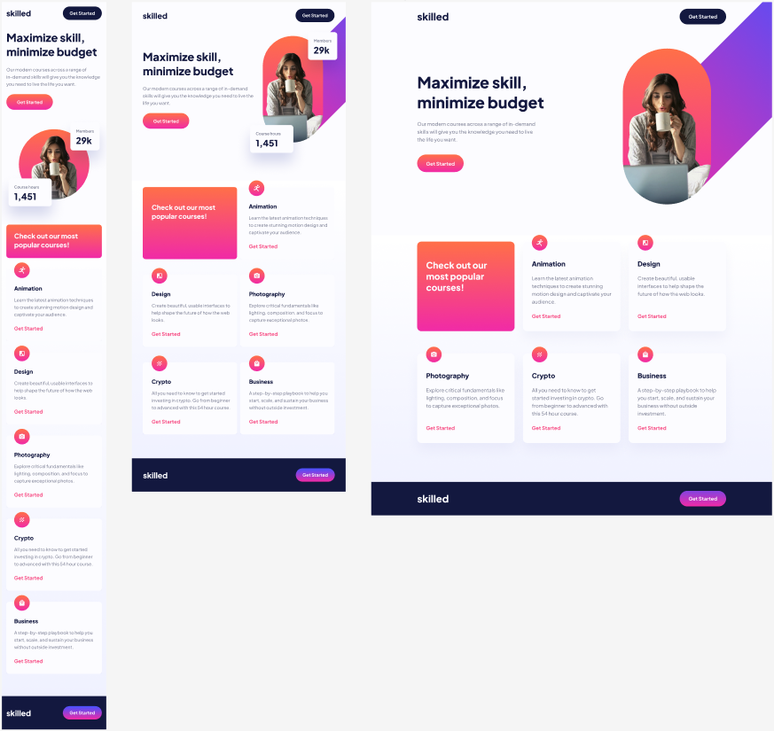

<h1 align="center" style="color: #0366d6;">
   Elerning landing page
</h1>

Este proyecto personifica una landing page de diseño adaptativo, desarrollada con precisión mediante HTML y Sass. Su principal enfoque radica en proporcionar una experiencia excepcionalmente optimizada que se adapta de manera fluida a diversos dispositivos, abarcando desde móviles y tablets hasta pantallas de escritorio de distintos tamaños con meticulosa atención al detalle.

---

  

---

## Características 🚀

- **Adaptabilidad Total:** 📱💻 La web se ajusta dinámicamente para proporcionar la experiencia de usuario más óptima en dispositivos móviles, tablets y escritorios.

- **Diseño de Grid Fluido:** 🎨 Utiliza un grid fluido que garantiza una adaptación elegante del contenido a una variedad de tamaños de pantalla.

- **Media Queries Avanzadas:** 🖥️ Se han implementado consultas multimedia avanzadas para optimizar la presentación en dispositivos específicos, tales como:

  - Tablets (768px)
  - Tablets horizontales (1024px)
  - Pantallas de escritorio (1200px)
  - Escritorios XL (1440px)

## Tecnologías Utilizadas ⚙️

- **HTML Semántico:** 📝 Se ha implementado un marcado semántico para potenciar la accesibilidad y simplificar el mantenimiento del código.

  - 

- **Sass Modular:** 🎨 Sass se utiliza de manera modular para organizar el código CSS, mejorando la legibilidad y facilitando futuras expansiones.

  - 

## Licencia 📜

Este proyecto está bajo la licencia [MIT] - Consulta el archivo [LICENSE](LICENSE) para más detalles.
